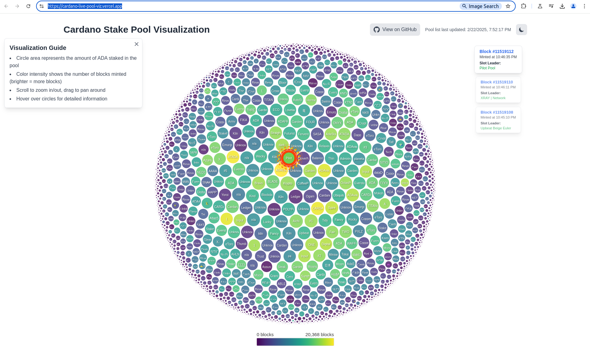

# Cardano Stake Pool Visualization

My project for Oxford Blockchain Society Cardano Hackathon 2025! A real-time visualization of Cardano stake pools using D3.js and Next.js. View the live deployment at [https://cardano-live-pool-viz.vercel.app/](https://cardano-live-pool-viz.vercel.app/) and see the demo video here [https://www.loom.com/share/3bde1161ce994f95b148ff9d70463b02?sid=63364db3-10f2-48db-9e67-7fb41f57f08d](https://www.loom.com/share/3bde1161ce994f95b148ff9d70463b02?sid=63364db3-10f2-48db-9e67-7fb41f57f08d)



## Features

- Interactive bubble chart visualization of all Cardano stake pools
- Real-time updates (every 15 seconds) showing the current slot leader
- Visual effects highlighting the current block producer
- Zoom and pan capabilities
- Detailed tooltips with pool information
- Live block notifications with links to block explorer

## Getting Started

First, set up your environment variables:

```bash
# Create a .env.local file with your Blockfrost API key
NEXT_PUBLIC_BLOCKFROST_PROJECT_ID=your_blockfrost_api_key
```

Then, run the development server:

```bash
npm run dev
# or
yarn dev
```

Open [http://localhost:3000](http://localhost:3000) with your browser to see the result.

## Technology Stack

- [Next.js](https://nextjs.org/) - React framework
- [D3.js](https://d3js.org/) - Data visualization
- [Blockfrost API](https://blockfrost.io/) - Cardano blockchain data
- [Tailwind CSS](https://tailwindcss.com/) - Styling
- [TypeScript](https://www.typescriptlang.org/) - Type safety

## Deploy on Vercel

The project is deployed on Vercel. You can deploy your own instance using the button below:

[](https://vercel.com/new/clone?repository-url=https%3A%2F%2Fgithub.com%2Fyour-username%2Fcardano-vis)
